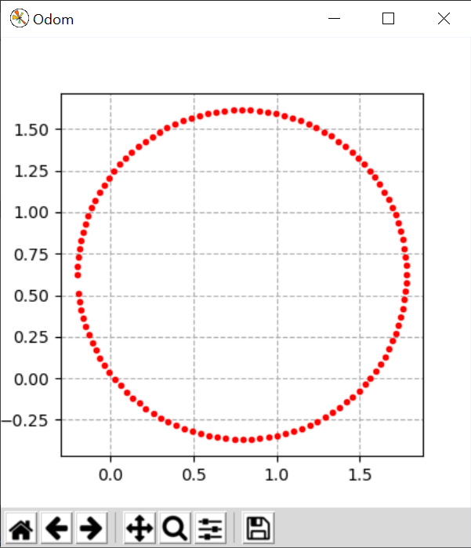

# Lab Assignment 4 - Turtlebot Navigation
## ECE-CSE 434 - Automated Vehicles

# Introduction

This lab will introduce writing nodes to control a Turtlebot, initially for a simple circle motion, and then for waypoint following.  All three of the exercises can be done using Gazebo on HPCC, or on the real Turtlebots using the control stations.  Online students will use Gazebo. In-person students will use the real Turtlebots, although it is recommended that you get your code working first with Gazebo, and then modify it to work on the physical Turtlebots. 

## Gazebo Preparations

Read and try out the commands in this page:
* **[3.3. Gazebo Simulator](https://gitlab.msu.edu/av/autonomous-vehicles/-/blob/2025/ROS/Gazebo_Simulator.md)**: Introduction to using Gazebo on the HPCC. 

Gazebo is only available on HPCC and for this lab you can work in an empty world:
```
ros2 launch turtlebot3_gazebo empty_world.launch.py
```
Make sure you can command the Turtlebot to drive around in a circle and then stop from the command line.  Also try out teleoperation.

It is important that your ROS workspace be built with only one ROS distro: either Jazzy or Humble but not both.  Your `~/av/ros_ws` workspace was used to build ROS packages running Jazzy.  Since in this lab we will use ROS Humble, let's create a new workspace for ROS Humble:
```
mkdir -p ~/av/humble_ws/src
```
Next add your `<student_repo>` to the `src` folder of this repo by creating a symbolic link to it, just like you did [here](https://gitlab.msu.edu/av/autonomous-vehicles/-/blob/2025/ROS/ROS_Packages.md#workspace-organization).  This way your repo can be used in multiple ROS workspaces.


## Physical Turtlebot Preparations

Before using the physical Turtlebots, read and carry out the instructions on the following pages:
* **[Control Workstation Setup](https://gitlab.msu.edu/av/autonomous-vehicles/-/blob/2025/Setup/Control_Workstations.md)**: The control workstations are needed to control the physical Turtlebots 
* **[3.4 TurtleBot 4](https://gitlab.msu.edu/av/autonomous-vehicles/-/blob/2025/Setup/ROS/Turtlebot4.md)**: How to operate the physical Turtlebots

On the control station, set up your environment just like you did for HPCC.  Create your `ros_ws` in `~/av` with:
```
mkdir -p ~/av/ros_ws/src
```
Clone the `labs_sol` and `<studen_repo>` repo into `~/av`, and make a symbolic link to your `<student_repo>` from the workspace `src` folder.  

## Switching between HPCC and Control Workstations

The package you make in you `<student_repo>` will work on both HPCC and control workstations.  The important thing is to only edit **one instance of your repo at a time**.  If you change your repo on one of them, say HPCC, then make sure to `git add`, `git commit` and `git push` on HPCC and do a `git pull` on the control workstation.  Only then make changes on the control workstation.  If you don't do this, then you will have to merge changes.  VSCode has tools for merging, but it is tricky, and it's much better to avoid it.  If you get stuck with merging that doesn't work, you can always rename your repo, pull a new version and manually copy any changes you made.  

## Create A ROS Package

Choose where you will start working, either in the `humble_ws` on HPCC or your `ros_ws` on the control station.  Then inside the `src/<student_repo/>` folder create a folder called `lab4_nav`.  From inside this folder create a package called `bot_drive` using the command:
```
ros2 pkg create --build-type ament_python --license Apache-2.0 bot_drive
```
In this lab you will create three nodes for your new `bot_drive` package.  Start by copying the Python files provided in `labs_25/lab4_nav/code` into the `bot_drive/bot_drive` folder of your package (where you see a `__init__.py` file).  These will get you started.

# Exercise 1: Circle Drive (5 Points)

Part of the code provided is `circle_drive.py`.  It is important to understand how it works, as you'll use concepts from it in Exercise 3.  There is an explanation for a somewhat simpler node here: [Gazebo / Python Node](https://gitlab.msu.edu/av/autonomous-vehicles/-/blob/2025/ROS/Gazebo_Simulator.md#python-node-for-turtlebot-control), and for this exact code here: [Turtlebot 4 / ROS Node](https://gitlab.msu.edu/av/autonomous-vehicles/-/blob/2025/ROS/Turtlebot4.md#ros-node-to-control-the-turtlebot).

To add this Node to your `bot_drive` package, make sure the import dependencies are set in `package.xml` and add an entry point in your `setup.py` file.  The entry point should define node executable as `circle_drive`. 

Then from the **top level of your workspace**:
```
colcon build --symlink-install --packages-select bot_drive
source install/setup.bash
```
At this point you can run your node for a simulated Turtlebot in Gazebo with:
```
ros2 run bot_drive circle_drive
```
For the physical turtlebot, you'll need to include the argument `--real_robot`.  Test to make sure this drives the Turtlebot in an approximately complete circle.  Try adjusting the `--lin_x` and `--ang_z` argument values to see how that affects the circle.

Always make sure your code runs with the **exact ros2 command** specified in the exercise, as the grader will use scripts that call that command in grading your assignment.  

# Exercise 2: Bot Monitor (5 Points)

The goal of this assignment is to create a Turtlebot driving monitor.  It should plot the trajectory that the Turtlebot takes in an `x-y` axes plot updating its points in realtime with a final result something like this for circle driving:



From the `ros2 topic list`, you may notice that the Turtlebot is publishing a topic called `/odom` (possibly with a namespace prefix).  You can find out the contents of this using the `ros2 topic info` and `ros2 interface show` commands.  Or you can use the Topic Monitor in `rqt` to explore the contents of `/odom`.  Either way, determine from which portion of `/odom` you can get the Turtlebot's location.  Then write a node called `bot_monitor` that subscribes to `/odom` and plots the location of the Turtlebot *updated in real time* in a window.  Use the provided `bot_monitor.py` code and complete the missing portions of it.  Your code should run with:  
```bash
ros2 run bot_drive bot_monitor
```
Your bot monitor node should display the Turtlebot trajectory similar to the illustration above.  Note: for the sake of memory and computation, it is a good idea *not to plot every point from /odom*, but rather only plot points if they differ by a minimum displacement from the previously plotted point.  

You can use the following command to clear the bot monitor plot:
```
ros2 param set /bot_monitor bot_plot clear
```
And you can save an image of the current view to an image called `bot_plot.png` with:
```
ros2 param set /bot_monitor bot_plot save
```
### Submit for Ex 2:
* The updated version of `bot_monitor.py` in the package
* The package with the working node `bot_monitor`
* The saved image `bot_plot.png` in the `lab4_nav` folder.

___
# Exercise 3: Simple Waypoint Navigation

The goal of this assignment is to write a node called `waypoint_nav` that will drive the Turtlebot to various waypoints that are being published to the `/waypoints` topic. The algorithm for `waypoint_nav` is as follows:
1.  Always be listening for a new waypoint (one that differs from the previous waypoint). When it receives a new waypoint it should set this as the current waypoint and interrupt whatever it is doing and go to step (2)
2.  Rotate the robot to point towards the current waypoint and go to step (3)
3.  After rotating, drive towards the current waypoint.   
4.  While driving if the distance to the current waypoint is less than 0.1m it should stop
5.  While driving if distance to the waypoint starts to increase, then go to step (2)  

## Some Details
* The skeleton of the code is provided in `waypoint_nav.py`.  Complete this code.
* The `/waypoints` topic type is `PointStamped`. Extract  `point.x` and `point.y` as the `(x,y)` waypoint coordinates.
* Note that the topic could have been with the namespace prefix, enabling multiple robots to be controlled.  But for simplicity will just use `/waypoints`.
* Publish a waypoint `(1.,1.)` with:
    ```bash
    ros2 topic pub /waypoints geometry_msgs/msg/PointStamped "{point: {x: 1.0, y: 1.0}}"
    ```
* It is helpful to run `bot_monitor` to observe the path of your robot.
* This exercise should be solved **closed loop** with feedback from `/odom`; that is, you must subscribe to `/odom` to get the current heading as well as `[x, y]` position. Using `/odom` you can check the distance to the current waypoint.
* Your node must run with the command:
```bash
ros2 run bot_drive waypoint_nav
```
There should be optional arguments as follows:
```bash
ros2 run bot_drive waypoint_nav --lin_x 0.3 --ang_z 0.5 --real_robot
```
Here `--lin_x` is the forward linear speed, `--ang_z` is the angular speed for changing heading, and `--real_robot` will cause it to output a `TwistStamped` for the Turtlebot 4.

### Submit for Ex. 3
1. Updated code `waypoint_nav.py` along with the package that works as described
2.  Have your robot navigate to the $4$ waypoints `{(1.0, 1.0), (-1.0, 1.0), (-1.0, -1.0), (1.0, -1.0)}`, that you'll pass to the `/waypoint` topic one by one from another terminal.  Use linear speed of 0.3 m/s and angular speed of 0.5 rad/s. Starting with a clear plot, record the trajectory the robot takes with `bot_monitor` and save it to an image `square_slow_gazebo.png` or `square_slow_real.png` (depending if you are in Gazebo or not) in your `lab4_nav` folder.
3. Repeat (2) but with a linear speed of 2.0 m/s and angular speed of 1.5 rad/s.  Save the result from `bot_monitor` to either `square_fast_gazebo.png` or `square_fast_real.png` (as appropriate).

# Submitting this lab
To submit everything do:
```
cd <student_repo>/lab4_nav
git add .
git commit -m "Add a comment here"
git push
```
